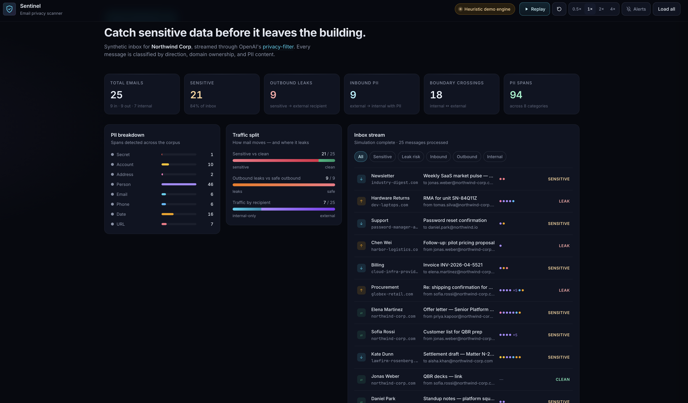
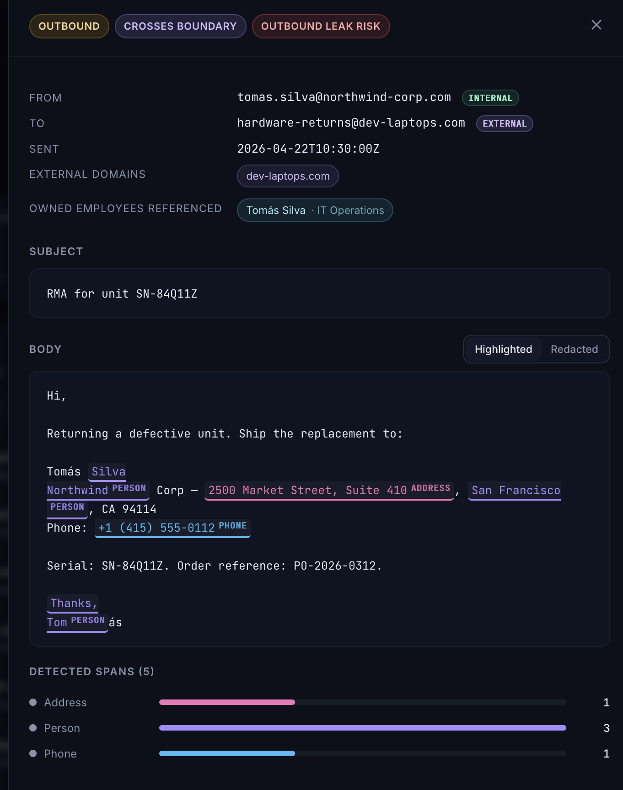
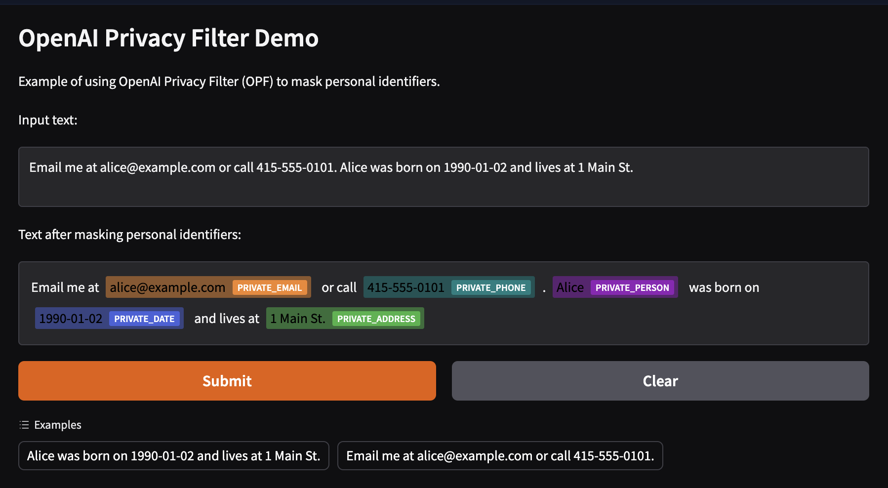

# Sentinel — Email Privacy Scanner

A local proof-of-concept for exploring potential privacy risks in a synthetic corporate inbox. It scans a fixed corpus, then replays the results with direction (inbound / outbound / internal), example domain ownership, and detected spans in the subject and body.

Detection runs through [OpenAI's Privacy Filter (`opf`)](https://github.com/openai/privacy-filter) when it is installed in the venv, and falls back to a regex heuristic so the demo boots on a fresh machine. The active engine is shown in the top-right corner of the dashboard.

## Current use case

A developer or privacy reviewer can compare the two engines, inspect detected spans,
and discuss which outbound messages would deserve human review. The dashboard's
"Leak risk" means that an outbound sample contains detected sensitive content and
has an external recipient. It is a review signal, not evidence of a policy violation.
"No findings" does not establish that a message is safe.

The app has no mailbox connection, delivery interception, blocking, quarantine,
attachment scanning, or persistent review workflow. The inbox and employee directory
are synthetic. Detection runs locally; installing dependencies and the first OPF
scan can download packages, tokenizer data, and model weights. The dashboard uses
system fonts and does not request third-party web assets.

The redacted view masks detected subject and body spans. Sender, recipient, employee,
and other metadata remain visible, and the API returns original text and span values.
It is an inspection tool, not an anonymized export. Keep the development server on
localhost and use synthetic input: it has no authentication or request quotas.

### Decisions needed before a real-mail pilot

- Choose a retrospective review tool or an inline delivery control. An inline system
  needs an explicit allow, block, or defer policy when detection fails.
- Define which labels and recipient relationships require review, along with trusted
  domains, exceptions, and who can make those decisions. PII presence alone is not a policy.
- Establish labeled evaluation data with expected spans, including supported languages,
  Unicode, forwarded mail, and attachments. Current tests establish code behavior, not
  detector recall or precision.
- Define access control, raw-text retention, audit history, request limits, and deployment
  ownership before accepting real email. Model inference is serialized within one
  process; throughput and concurrent request behavior need a separate workload test.

## Screenshots

### Replay dashboard
A simulated inbox streams past with per-direction counts, PII label breakdowns, and sensitivity badges.



### Inspection drawer
Clicking a message opens a drawer with highlighted spans, classification badges, and a redacted view.



### Underlying engine (OPF)
When the real `opf` model is installed, span detection uses OpenAI Privacy Filter. Their own demo (bundled in the [privacy-filter repo](https://github.com/openai/privacy-filter)) looks like this:



OPF detects eight span types: `private_person`, `private_email`, `private_phone`, `private_address`, `private_url`, `private_date`, `account_number`, `secret`. The heuristic fallback targets the same labels with coarse regexes.

## Stack

- **Backend:** FastAPI + Uvicorn (Python 3.14, managed by [uv](https://docs.astral.sh/uv/))
- **Frontend:** static HTML/CSS/JS served from `frontend/`, no build step
- **Detection:** `opf` (optional) or regex fallback, selected at runtime in `backend/detector.py`

## Quickstart

Requires [uv](https://docs.astral.sh/uv/) and Python 3.14 (uv will download it if missing).

```bash
make install       # uv sync --locked — creates .venv from uv.lock
make run           # starts uvicorn on :8000 with reload
make open          # opens http://127.0.0.1:8000 in the browser
```

Or without `make`:

```bash
uv sync
uv run uvicorn backend.main:app --reload --port 8000
```

## Switching to the real OPF engine

The heuristic mode is always available. To swap in OpenAI's model:

```bash
make install-opf     # installs the pinned OPF optional dependency
make engine          # initializes the adapter and prints the selected engine
```

The selection is saved in the ignored `.opf-enabled` file. Subsequent `make install`,
`make run`, `make engine`, and `make scan` commands retain OPF. The upstream revision
is pinned in `pyproject.toml` and resolved in `uv.lock`; no editable clone is required.

The first non-empty scan downloads missing model weights to `~/.opf/privacy_filter`.
Set `OPF_CHECKPOINT` to use an existing checkpoint directory. CPU is the default;
use `OPF_DEVICE=cuda make run` on a CUDA-capable machine. The engine command reports
adapter selection; use `make scan` to exercise inference.
An unavailable OPF package selects the heuristic. A broken installed OPF dependency
or invalid model configuration raises an error instead of silently changing engines.

To go back:

```bash
make uninstall-opf
```

Restart a running server after switching engines. When running uv directly, include
`--extra opf` in both `uv sync` and `uv run` to select OPF; the saved selection applies
to the Makefile commands.

## Checks

```bash
make test           # Python/API/engine-workflow tests, then frontend DOM tests
make check          # tests plus Python and npm vulnerability audits
```

Tests require Node.js 22.22.2, 24.15+, or 26+ in addition to Python and uv. Frontend test
dependencies are development-only; serving the UI still requires no build step.
GitHub Actions runs `make check` with Python 3.14 and Node 24, with additional UI
tests on Node 22.22.2 and 26. Tests use synthetic data and an offline OPF
test double, so they do not download model weights or verify real model inference.

The Python audit exports locked default, development, and optional OPF dependencies
and checks registry packages applicable to the current platform without installing
the model stack. The pinned OPF Git revision itself has no PyPI advisory record and
is excluded from that audit. `npm audit` includes frontend test dependencies.
Audits require network access; Dependabot proposes weekly uv, npm, and Actions updates.

Scan responses declare `offset_unit: "unicode_code_points"`. Span offsets are
zero-based, start-inclusive and end-exclusive. Both engines normalize overlapping
matches into disjoint spans covering every matched character, with secrets taking
label precedence. The UI highlights using this offset contract and displays the
backend's `redacted_text` when redaction is selected.

## Handy targets

| Target | What it does |
| --- | --- |
| `make install` | Sync locked dependencies, retaining the selected engine |
| `make lock` | Refresh `uv.lock` |
| `make run` | Start the dev server (auto-reload) |
| `make engine` | Print the active detection engine |
| `make scan` | Pipe stdin through the detector (`echo 'hi alice@acme.com' \| make scan`) |
| `make install-opf` / `make uninstall-opf` | Swap the detection engine |
| `make test` | Run backend, API, engine-switching, and frontend regression tests |
| `make check` / `make audit` | Tests plus audits / dependency audits only |
| `make clean` | Purge `__pycache__` and `.pyc` |
| `make reset` | `clean` + wipe `.venv`, legacy `.opf-src`, and engine selection |

## Credits

Detection is powered by [OpenAI Privacy Filter](https://github.com/openai/privacy-filter) — a 1.5B-parameter bidirectional token classifier for PII detection, Apache 2.0 licensed.
