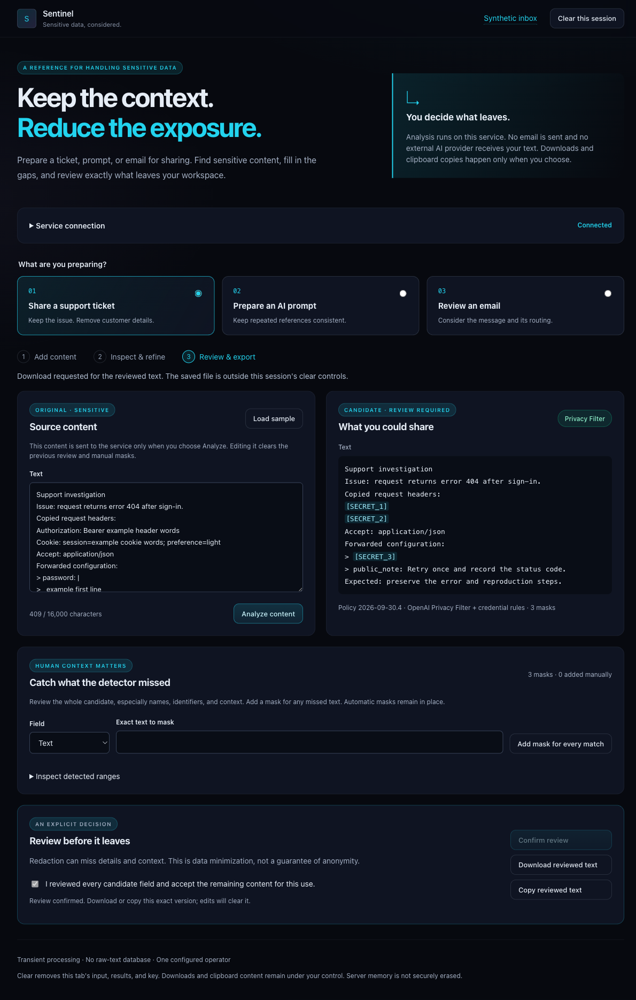

# Review a support log before sharing it

A support operator may need to share the failed request and reproduction steps
without sharing the session used to make that request. Copied authorization headers
can contain credentials ([HTTP authentication](https://www.rfc-editor.org/rfc/rfc9110.html#section-11.6.2));
cookies can carry session state ([HTTP cookies](https://www.rfc-editor.org/rfc/rfc6265.html#section-4.2)).
Policy `2026-09-30.4` removes those whole header lines and credential blocks inside
forwarded text. Cookie preferences are removed too: this is a conservative sharing
rule, not a claim that every cookie value is secret.

## Synthetic example

Start the real-model container from the [runtime guide](runtime.md), connect the
workbench and select **Share a support ticket**. Paste this invented example:

```text
Support investigation
Issue: request returns error 404 after sign-in.
Copied request headers:
Authorization: Bearer example header words
Cookie: session=example cookie words; preference=light
Accept: application/json
Forwarded configuration:
> password: |
>   example first line
>   example second line
> public_note: Retry once and record the status code.
Expected: preserve the error and reproduction steps.
```

Choose **Analyze content**. Review all remaining text and add manual masks if the
message contains other identifying details. Confirm the review and download the
exact approved text. The real OPF Browser walkthrough on 2026-09-30 produced:

```text
Support investigation
Issue: request returns error 404 after sign-in.
Copied request headers:
[SECRET_1]
[SECRET_2]
Accept: application/json
Forwarded configuration:
> [SECRET_3]
> public_note: Retry once and record the status code.
Expected: preserve the error and reproduction steps.
```

## Scope and evidence

The 24 cases in `evaluation/support-log-cases.json` cover mixed case, indentation,
wrapped headers, quoted and nested forwarded blocks, CR/LF variants, Unicode offsets,
and misleading negative field names. Nineteen positive cases failed the preceding
policy and now require complete coverage without any model findings. The five
negative cases require unchanged output. Following public context is also asserted.

The real OPF smoke check exports all 19 positive cases, in addition to the existing
25-email corpus and three workflow checks. The container gate checks a combined
authentication-header/forwarded-block example, exact export and replay rejection.
The raw-model benchmarks remain unchanged and retain their documented misses.

The Browser walkthrough compared the actual downloaded bytes with the prepared
and exported candidate. All three masks matched, and the error, `Accept` header
and reproduction steps remained. Download was unavailable before confirmation.
Browser storage stayed empty, recorded requests stayed on the local service, and
there were no console errors. Clear removed the source and connection before the
temporary container project was stopped.



These rules recognize copied line-oriented headers and indented blocks. They do
not promise arbitrary JSON, shell-command, attachment or encoded-secret parsing.
Keep the human review step. Export produces a local artifact; nothing is posted
to a ticket system or sent to an external AI provider.
