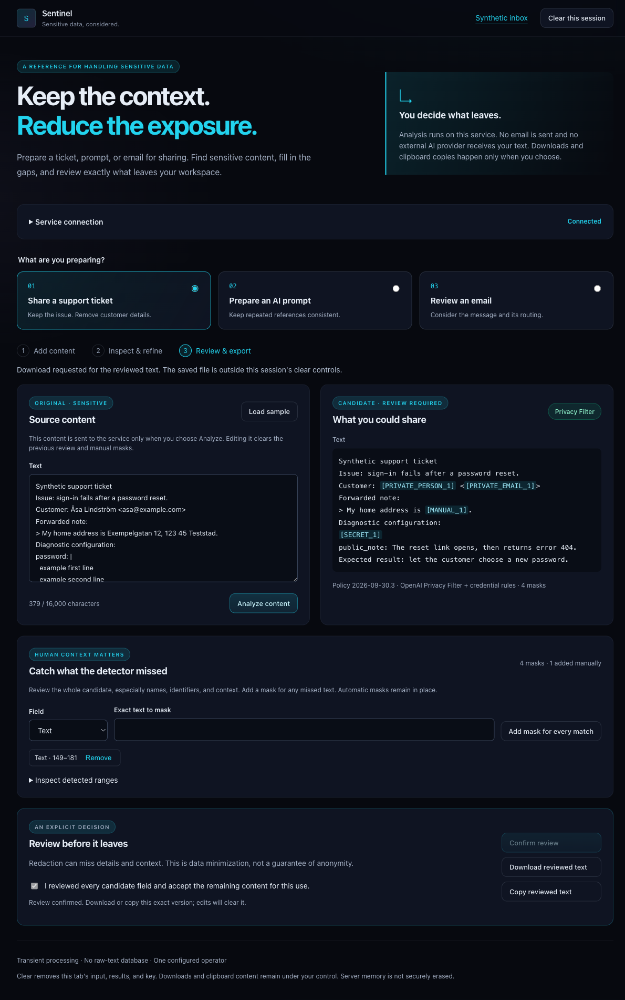

# Share a ticket with troubleshooting context intact

The first concrete use case is a support operator sharing an issue with an engineer
who needs the symptoms but not the customer's identity, contact details, home
address or credentials. The reference accepts pasted text and produces an explicitly
reviewed plain-text download. It does not fetch tickets or post to another system.
Connecting a ticket system requires a separate source/destination contract.

This walkthrough used the real offline OPF container from the [runtime guide](runtime.md)
on 2026-09-30. All values below are invented.

1. Connect the local workbench and select **Share a support ticket**.
2. Paste this synthetic ticket and choose **Analyze content**:

```text
Synthetic support ticket
Issue: sign-in fails after a password reset.
Customer: Åsa Lindström <asa@example.com>
Forwarded note:
> My home address is Exempelgatan 12, 123 45 Teststad.
Diagnostic configuration:
password: |
  example first line
  example second line
public_note: The reset link opens, then returns error 404.
Expected result: let the customer choose a new password.
```

3. Inspect every candidate field. In this run OPF detected the name, email and
   address components; the credential policy covered the multiline value. Other
   contexts can produce different misses, as the expanded evaluation demonstrates.
4. Add a mask for the exact text `Exempelgatan 12, 123 45 Teststad`, then analyze
   again. This demonstrates a complete manual address mask and invalidates the
   earlier review. Automatic masks remain applied.
5. Confirm that the remaining text is appropriate for this recipient, check the
   review confirmation, choose **Confirm review**, then **Download reviewed text**.

The observed output was:

```text
Synthetic support ticket
Issue: sign-in fails after a password reset.
Customer: [PRIVATE_PERSON_1] <[PRIVATE_EMAIL_1]>
Forwarded note:
> My home address is [MANUAL_1].
Diagnostic configuration:
[SECRET_1]
public_note: The reset link opens, then returns error 404.
Expected result: let the customer choose a new password.
```

The Browser check compared the downloaded bytes to the exact API-reviewed candidate;
they matched. All six synthetic sensitive values were absent and the troubleshooting
sentence remained. The workbench showed OPF and policy `2026-09-30.3`, retained no
browser storage, and cleared its source and connection when the session was cleared.
Downloads remain under the operator's control.


