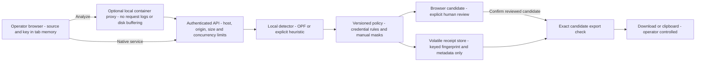

# Trust boundaries and privacy limits

Sentinel is a local, single-operator reference for developers building a review
step before sharing sensitive text. It demonstrates minimization, inspection,
manual correction, and explicit export. It is not an anonymization engine, policy
authority, compliance certification, mailbox gateway, or multi-tenant service.

## Data flow

Raw source travels from the browser to the service only on Analyze. The container
proxy also handles it in transit and belongs to the trusted boundary. Detection
and policy processing happen in memory. A candidate remains sensitive: missed
values and contextual clues can survive. Its receipt binds the entire candidate,
use case, policy version, engine, and routing summary to one export decision.

The browser submits that same candidate on confirmation. The server checks its
keyed fingerprint and consumes the receipt atomically. Only the verified returned
candidate enables download/copy. The API caller controls the confirmation flag;
the server cannot prove that a human actually read the text. The browser provides
the explicit review interaction, and integrators must preserve that boundary.

## Assets and adversaries

Protect source text, candidate text, the operator key, and the integrity of the
reviewed artifact. Relevant threats include an unauthenticated API caller, a
foreign website targeting a local server, malicious text rendered as HTML, a
modified/replayed candidate, detector misses or failures, and accidental disclosure
through errors, logs, browser persistence, or export metadata.

The operator, browser, application dependencies, model checkpoint, optional proxy,
host OS, and Docker daemon are trusted. A compromised host, extension, dependency,
or authorized operator can access data. Possession of the configured key grants
the one principal's access; there are no user roles or tenant boundaries.

| Threat | Implemented control | Remaining boundary |
| --- | --- | --- |
| Arbitrary unauthenticated input | Bearer key checked before request bodies; absent key disables input | Public loopback GET APIs contain synthetic fixtures only; protect the host and key |
| Cross-site or DNS-rebinding access | Exact allowed host and same-origin checks; no wildcard CORS; self-only scripts/connections and anti-framing headers | Loopback is not authentication; native clients can set headers and still need the key |
| Source reflected in errors or logs | Fixed validation/model error codes; no request access logs; no raw text in review events | Proxies, model libraries, debugging tools, crash dumps and OS storage require operator controls |
| HTML/script injection | Source and candidate rendered with DOM text nodes; scripts served locally under CSP | Browser extensions and compromised served code are outside this control |
| Missed sensitive information | Measured model evaluation, supplementary credential rules, manual masks and full-candidate review | Neither engine detects all PII or secrets; indirect identifiers and encoded data can survive |
| Candidate modification or replay | HMAC fingerprint of the canonical candidate; 10-minute expiry; atomic one-use receipt | An authorized caller can prepare another candidate; confirmation is an application contract, not human attestation |
| Unbounded work or storage | 64 KiB bodies, 16,000 code points, body deadline, one inference slot, bounded receipts/events and container resources | A stuck native inference requires restart; a malicious key holder can deny service |
| Unexpected export | Whole email routing fields removed; explicit confirmation; exact returned candidate used for text export | Downloads and clipboard content remain outside Clear; the operator controls downstream sharing |
| Persisted source or identity mapping | No raw-text database, cookies, analytics or browser storage; per-request placeholders | Memory clearing is logical, not secure physical erasure; browser/OS caches, swap and backups are trusted |
| Outbound model call | Local inference; cached real-model check denies Python network calls; container processor has no external route | Initial provisioning downloads dependencies/assets; native deployments need OS egress controls; proxy and host are trusted |

## Retention

| Location | What can exist | Removal or bound |
| --- | --- | --- |
| Browser tab | Key, source, masks, candidate, reviewed result | Clear, page departure, or 15 minutes without input/key/pointer activity; stale responses cannot restore cleared state |
| API request and model memory | Source, spans, intermediate values and candidate | No application disk persistence; references released after processing, without a memory-erasure guarantee |
| Review store | Random receipt, keyed fingerprint, expiry and non-content counts | At most 256 pending receipts; expiry after 10 minutes, pruned on store operations; consumed/discarded/restart clears |
| Review events | Random event ID, time, fixed operator identity, action, use case, engine, policy and counts | Last 128 events in memory until restart; no receipt, source, candidate, matched value or IP |
| Container temporary space | Runtime temporary files in RAM | Bounded tmpfs; no persistent content volume; cleared with container lifecycle |
| Clipboard/downloads | Exact reviewed text | Operator-controlled; not removed by Clear or server restart |

When changing engines, policy, or the operator key, restart the single service
process. Outstanding reviews become unavailable and must be prepared again.
Do not implement sticky multi-worker routing as a substitute for a deliberate
shared review-store and identity design.

## Deliberate scope boundaries

The credential policy treats arbitrary input as plain text. It masks assignment
syntax as well as values and does not promise parseable JSON/YAML output. Quoted
keys, escaped quotes and unfinished quoted values have regression coverage;
obfuscated, encoded, multiline, unusual or unnamed credentials still need review.
The 21-case detector benchmark is separate from the ten credential-policy cases.

No message is sent and no external AI API is invoked. Attaching an email sender,
mailbox connector, external model, persistent audit sink or shared-user identity
provider changes the data flow. Define authorization, destination restrictions,
retention, failure behavior and real-data acceptance criteria for that extension.
Attachment/OCR processing, encrypted files, automatic policy enforcement, shared
hosting and legal compliance claims are outside this reference's acceptance scope.
